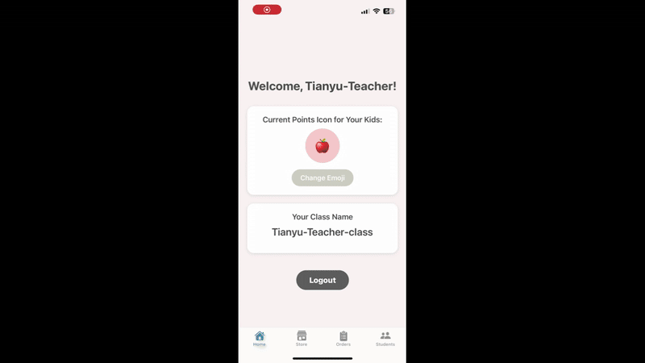

# Welcome to Milk Bear Shop 👋
Milk Bear Shop is a [mobile app](https://apps.apple.com/us/app/milk-bear-shop/id6739957470) designed to enhance engagement teachers/parents and their kids. It offers distinct UI and UX for teachers and kids. When registering an account, it allows you to choose whether you want to create an account as teacher or student.

## Features for Teachers/Parents
- **Manage Students**: Easily add or remove kids from their class roster.
- **Point System Control**: Reward or deduct points to encourage positive behavior and accountability.
- **Store Management**: Upload and edit store items, including images, names, prices, and customizable options.
- **Personalized Rewards**: Customize the point icon to make collecting points more exciting for kids.
- **User-Friendly Interface**: A cozy design that makes the experience enjoyable.

## Features for Kids
- **Real-Time Notifications**: Get push alerts when earning or losing points.
- **Seamless Shopping Experience**: Save favorite items to the cart and check out easily.
- **Personalized Progress Tracking**: track progress with a game-like bar showing how close they are to affording their desired items.
- **Engaging and Warm Design**: A warm, inviting interface that provides fun using experience.

## How It Works: Teacher
- **Change Point Icon & Upload/Edit Store Items**
  
  
